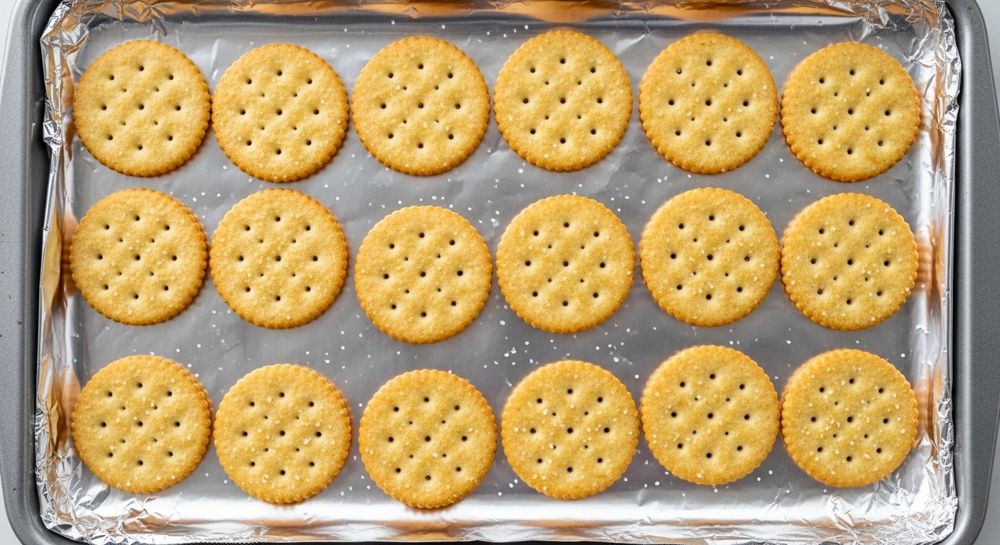
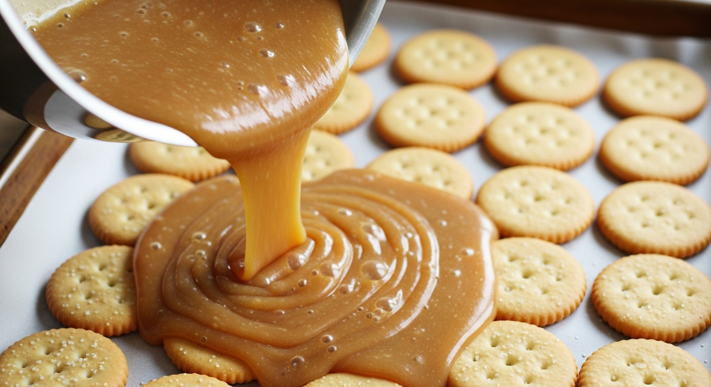

## Description

Get ready to meet your new holiday addiction: **Christmas Cracker Candy**. Also known as _cracker toffee_ or _saltine toffee bark_, this treat is the perfect storm of sweet, salty, buttery, and crunchy. It's ridiculously **easy to make** with just a handful of simple ingredients, making it the ideal recipe for holiday parties, cookie exchanges, or last-minute gifts. The combination of salty crackers, rich homemade toffee, and a smooth layer of chocolate is simply irresistible. You'll wonder how you ever celebrated the holidays without it!

## Ingredients

### Candy Base
* **~40 saltine crackers** (enough to cover a baking sheet in a single layer)
* **1 cup unsalted butter** (2 sticks)
* **1 cup packed light brown sugar**
* **1/2 tsp vanilla extract**
* **Pinch of salt**

### Topping
* **2 cups semi-sweet chocolate chips** (about 12 oz)
* **Optional:** Holiday sprinkles, chopped pecans, walnuts, flaky sea salt, or crushed peppermint candies

## Instructions

1.  **Preheat Oven & Prep Pan:** Set your oven to 400°F (200°C). Line a standard 10x15 inch rimmed baking sheet with aluminum foil, making sure the foil goes up the sides. For extra non-stick insurance, lightly spray the foil with cooking spray.
2.  **Arrange the Crackers:** Place the saltine crackers in a single, even layer across the bottom of the prepared baking sheet, covering the entire surface. Try to fit them snugly side-by-side.

    

3.  **Make the Toffee:** In a medium, heavy-bottomed saucepan, combine the butter and brown sugar. Bring the mixture to a boil over medium heat, stirring constantly. Once it reaches a rolling boil, continue to boil for exactly 3 minutes, stirring occasionally. Be careful, as the mixture is very hot.
4.  **Pour Toffee & Bake:** After 3 minutes, immediately remove the saucepan from the heat. Stir in the vanilla extract and a pinch of salt. Working quickly, pour the hot toffee mixture evenly over the layer of saltine crackers. Use an offset spatula to spread it smoothly to the edges if needed.

    

5.  **Bake the Toffee Layer:** Place the baking sheet in the preheated oven and bake for 5-6 minutes, or until the toffee is bubbly all over.
6.  **Add Chocolate:** Remove the pan from the oven and immediately sprinkle the chocolate chips evenly over the hot toffee. Let it sit for 5 minutes. The residual heat will melt the chocolate chips.
7.  **Spread and Decorate:** After 5 minutes, use an offset spatula to spread the melted chocolate into a smooth, even layer. If you're adding toppings, sprinkle them over the melted chocolate now.

    

8.  **Chill to Set:** Place the entire baking sheet in the refrigerator or freezer until the chocolate is completely firm, about 1-2 hours in the fridge or 30 minutes in the freezer.
9.  **Break and Serve:** Once firm, lift the foil out of the pan. Break the candy into irregular pieces with your hands. Store in an airtight container in the refrigerator for up to a week.

## Recommended Tools

*   **Rimmed Baking Sheet:** Essential for containing the hot toffee and creating an even layer. [Link Label: Buy a Rimmed Baking Sheet on Amazon]
*   **Heavy-Bottomed Saucepan:** Helps prevent the sugar and butter from scorching while making the toffee. [Link Label: My Favorite Saucepan]
*   **Offset Spatula:** Makes spreading the hot toffee and melted chocolate incredibly easy and smooth.

*(Note: The links in the frontmatter might be affiliate links. If you purchase through them, we may earn a small commission at no extra cost to you. Thanks for your support!)*

## Tips for the Best Cracker Candy

### Watch the Toffee
Timing is key! Boiling the butter and sugar mixture for exactly 3 minutes creates the perfect toffee consistency. Boiling it for too short a time can make it greasy, while boiling too long can make it hard or cause it to separate.

### Work Quickly
Once the toffee is ready and the pan is out of the oven, you need to work fast. Pour the toffee and spread the chocolate while everything is still hot for the best results.

### Don't Skip the Foil
Lining your baking sheet with foil is a non-negotiable step for this recipe. It prevents a sticky mess and makes it a breeze to lift the candy out for breaking once it has set.

## Variations and Toppings

This recipe is a perfect canvas for creativity!

*   **Different Crackers:** While saltines are classic for their salty crunch, you can also try this with Ritz crackers, Club crackers, or even pretzels.
*   **Chocolate Swirl:** Use a mix of semi-sweet and white chocolate chips. After spreading the semi-sweet chocolate, drizzle the melted white chocolate over the top and use a toothpick to create beautiful swirls.
*   **Nutty Delight:** Add a cup of toasted, chopped pecans, walnuts, or almonds to the topping.
*   **Extra Salty:** A light sprinkle of flaky sea salt on top of the chocolate before it sets beautifully enhances the sweet and salty flavor.
*   **Minty Fresh:** Top with crushed peppermint candies or candy canes for a festive twist.

## Watch The Recipe Video

<iframe
  src="https://www.youtube.com/embed/2yY1T4gJtQ4"
  title="YouTube video player"
  frameborder="0"
  allow="accelerometer; autoplay; clipboard-write; encrypted-media; gyroscope; picture-in-picture"
  allowfullscreen>
</iframe>

## Frequently Asked Questions (FAQ)

### Why is my Christmas Cracker Candy chewy instead of crunchy?
This usually happens if the toffee mixture wasn't boiled long enough. Make sure to let it come to a full, rolling boil and then time it for 3 minutes before pouring it over the crackers.

### How do I store Christmas Cracker Candy?
Store it in an airtight container in the refrigerator. It will stay fresh and crisp for up to a week. You can store it at room temperature, but it may become slightly soft if your home is warm. It's best served chilled.

### Can I use a different type of chocolate?
Absolutely! Milk chocolate, dark chocolate, white chocolate, or even butterscotch chips work wonderfully. Use your favorite!

### Can I make this recipe ahead of time?
Yes, this is a perfect make-ahead treat! It keeps well in the refrigerator for a week and can be frozen in an airtight container for up to 2 months.

### My butter and sugar separated while making the toffee. What went wrong?
This can happen if the heat is too high or if the mixture isn't stirred enough at the beginning. Use medium heat and stir constantly until the sugar dissolves and the mixture begins to boil. A heavy-bottomed pan also helps distribute heat more evenly to prevent this.