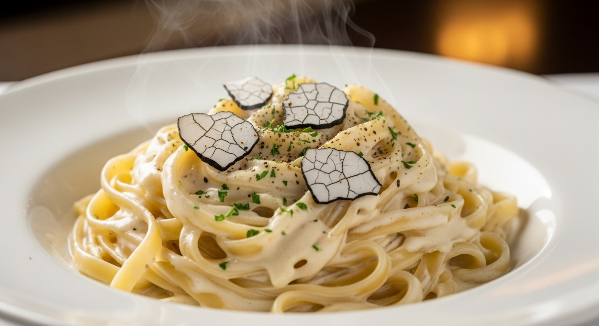

## Description

Forget the jarred stuff forever. This is the **classic Alfredo sauce recipe** that will transport you straight to a cozy Italian trattoria. In less than 20 minutes, you can create a velvety, rich, and deeply flavorful sauce that clings perfectly to every strand of pasta. Made with just a few high-quality ingredients—real butter, heavy cream, and authentic Parmigiano-Reggiano cheese—this homemade Alfredo sauce is a game-changer for weeknight dinners and special occasions alike. It's luxuriously creamy, incredibly simple, and a thousand times better than anything you can buy in a store.

## Ingredients

### For the Alfredo Sauce
*   **1/2 cup unsalted butter** (1 stick)
*   **1 1/2 cups heavy whipping cream**
*   **2 cloves garlic**, minced (or 1/2 tsp garlic powder)
*   **1 1/2 cups freshly grated Parmigiano-Reggiano cheese** (do not use pre-shredded)
*   **1/4 tsp salt**, or to taste
*   **1/4 tsp fresh black pepper**, or to taste
*   **2 tbsp fresh parsley**, chopped, for garnish

### For Serving
*   **1 lb fettuccine pasta** (or your favorite pasta shape)
*   **Reserved pasta water** (about 1/2 cup)

## Instructions

1.  **Cook the Pasta:** Bring a large pot of salted water to a rolling boil. Add the fettuccine and cook according to package directions until al dente. Just before draining, reserve about 1 cup of the starchy pasta water. Drain the pasta and set aside.
2.  **Melt Butter and Sauté Garlic:** In a large, heavy-bottomed saucepan or skillet over medium heat, melt the butter. Once melted, add the minced garlic and cook for about 1 minute until fragrant. Be careful not to let it brown.

    

3.  **Add the Cream:** Slowly pour in the heavy cream, whisking continuously. Bring the mixture to a gentle simmer and let it cook for 3-4 minutes, allowing it to thicken slightly. Reduce the heat to low.

    

4.  **Incorporate the Cheese:** Gradually add the freshly grated Parmigiano-Reggiano cheese to the cream mixture, a handful at a time, whisking constantly until the cheese is completely melted and the sauce is smooth. It's crucial to keep the heat on low to prevent the sauce from breaking or becoming grainy.
5.  **Season the Sauce:** Once the cheese is fully incorporated, remove the pan from the heat. Season with salt and fresh black pepper. Stir to combine. The sauce will continue to thicken as it cools.

    

6.  **Combine with Pasta:** Add the cooked fettuccine directly to the saucepan with the Alfredo sauce. Toss gently to coat every strand of pasta. If the sauce is too thick, add a tablespoon or two of the reserved pasta water to reach your desired consistency.
7.  **Serve Immediately:** Garnish with freshly chopped parsley and an extra sprinkle of Parmesan cheese. Alfredo sauce is best served immediately while it's hot and creamy.

    

## Recommended Tools

*   **Heavy-Bottomed Saucepan:** This is essential for even heat distribution, which prevents the cream and cheese from scorching and helps create a smooth sauce.
*   **Fine Mesh Whisk:** A good whisk is your best friend for incorporating the cheese without lumps.
*   **Box Grater or Microplane:** For the best results, you must grate your own cheese. Pre-shredded cheeses are often coated with anti-caking agents that prevent them from melting smoothly.

*(Note: The links in the frontmatter might be affiliate links. If you purchase through them, we may earn a small commission at no extra cost to you. Thanks for your support!)*

## Tips for the Best Alfredo Sauce

### Use High-Quality Ingredients
The beauty of this recipe is its simplicity, which means the quality of each ingredient really shines. Use real butter (not margarine), high-fat heavy cream, and, most importantly, a genuine block of Parmigiano-Reggiano cheese.

### Grate Your Own Cheese
This is the single most important tip. Pre-shredded cheeses contain starches and preservatives to prevent clumping, which will make your sauce grainy and prevent it from melting properly. Buy a block and grate it yourself just before using.

### Low and Slow is the Way to Go
When you add the cheese, the heat must be on low. If the sauce is too hot, the cheese will seize up, causing the fats to separate and creating an oily, clumpy mess. Patience is key to a silky-smooth sauce.

### Don't Forget the Pasta Water
That starchy, salty water from cooking your pasta is liquid gold. It helps emulsify the sauce and thin it out to the perfect consistency without diluting the flavor.

## Variations and Add-ins

This classic Alfredo sauce recipe is a fantastic base for customization.

*   **Chicken Alfredo:** Add grilled or pan-seared sliced chicken breast to make it a more substantial meal.
*   **Shrimp Alfredo:** Sauté some shrimp with garlic and butter and toss them in with the pasta and sauce.
*   **Broccoli Alfredo:** Add steamed broccoli florets for a touch of green and some added nutrients.
*   **Spicy Alfredo:** Add 1/4 to 1/2 teaspoon of red pepper flakes along with the garlic for a spicy kick.
*   **Cajun Alfredo:** Stir in some Cajun seasoning to taste for a zesty, flavorful twist.
*   **Mushroom Alfredo:** Sauté sliced cremini mushrooms in butter until golden brown before making the sauce in the same pan.

## Watch The Recipe Video

<iframe
  src="https://www.youtube.com/embed/bShzCgLhGso"
  title="YouTube video player"
  frameborder="0"
  allow="accelerometer; autoplay; clipboard-write; encrypted-media; gyroscope; picture-in-picture"
  allowfullscreen>
</iframe>

## Frequently Asked Questions (FAQ)

### Why is my Alfredo sauce grainy?
Graininess is almost always caused by one of two things: the heat was too high when the cheese was added, or you used pre-shredded cheese. Turn the heat down to low before whisking in the cheese, and always grate it fresh from a block.

### How do I fix a broken or oily Alfredo sauce?
If your sauce separates, remove it from the heat immediately. You can try to save it by vigorously whisking in a tablespoon of hot water or cream. Sometimes, a small amount of cornstarch slurry (1 tsp cornstarch mixed with 1 tbsp cold water) whisked in can help bring it back together, but prevention is the best method.

### Can I make Alfredo sauce ahead of time?
Alfredo sauce is best served fresh, as it tends to thicken and separate upon reheating. If you must make it ahead, store it in an airtight container in the fridge. Reheat it very gently in a saucepan over low heat, whisking constantly. You will likely need to add a splash of milk or cream to restore its consistency.

### Can I use milk instead of heavy cream?
While you can, it won't be the same. Heavy cream is essential for the rich flavor and thick, creamy texture of a classic Alfredo. Using milk (especially low-fat milk) will result in a much thinner sauce that is more prone to breaking.

### What's the difference between authentic Italian Alfredo and this American version?
The truly "authentic" Fettuccine Alfredo from Rome contains only three ingredients: fettuccine, butter, and Parmesan cheese. The creaminess comes from an emulsion created by vigorously tossing the hot pasta with butter, cheese, and starchy pasta water. The recipe here is the more common, cream-based American version, which is richer and easier for home cooks to master.