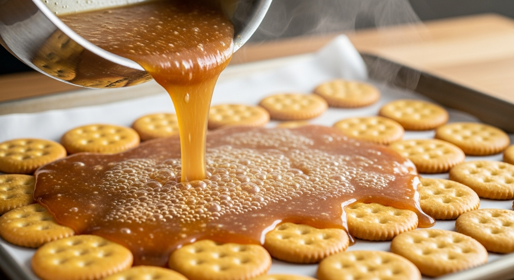
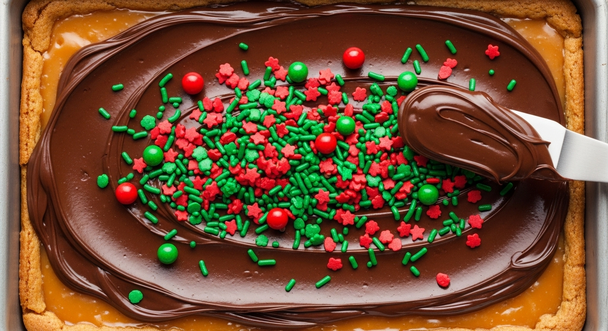

Looking for a last-minute holiday treat that's guaranteed to disappear from the cookie tin? Meet **Christmas Cracker Candy**, the sweet and salty confection that's ridiculously easy to make and impossibly addictive.

Also known as Saltine Toffee, this simple recipe transforms humble saltine crackers into a decadent treat. A layer of crackers is covered in a buttery, brown sugar toffee, baked until crisp, and then topped with a layer of melted chocolate. The result is a crunchy, chewy, chocolatey candy that hits all the right notes. It's the perfect easy recipe for holiday parties, cookie exchanges, or just a festive movie night at home.

## What is Christmas Cracker Candy?

Christmas Cracker Candy is a simple confection made from four main components:
1.  **Crackers:** Typically saltines, which provide a salty, crunchy base.
2.  **Toffee:** A simple mixture of butter and brown sugar boiled together and poured over the crackers.
3.  **Chocolate:** Melted and spread over the baked toffee layer.
4.  **Toppings:** Optional but highly encouraged! Think nuts, sprinkles, or sea salt.

When baked, the toffee seeps into the crackers, creating a texture that’s part cookie, part candy bar. It’s a holiday classic for a reason!

## Ingredients You'll Need

This recipe uses simple pantry staples, making it perfect for spontaneous baking sessions.

*   **1 sleeve of saltine crackers** (about 40 crackers)
*   **1 cup unsalted butter** (2 sticks)
*   **1 cup packed dark brown sugar**
*   **1.5 cups (about 9 oz) semi-sweet chocolate chips**
*   **Optional toppings:** Chopped pecans, flaky sea salt, or festive sprinkles

## Step-by-Step Instructions

1.  **Preheat and Prep:** Preheat your oven to 350°F (175°C). Line a large, rimmed baking sheet (approximately 13x18 inches) with parchment paper or aluminum foil. This is crucial for easy cleanup!
2.  **Arrange the Crackers:** Place the saltine crackers in a single, tight layer on the prepared baking sheet, covering the entire surface. Don't worry if you have to break a few to fill in any gaps.

    

3.  **Make the Toffee:** In a medium saucepan over medium heat, melt the butter and brown sugar together. Bring the mixture to a boil, stirring constantly. Once it reaches a rolling boil, continue to boil for exactly 3 minutes, still stirring. The mixture will thicken slightly.
4.  **Pour the Toffee:** Immediately (and carefully!) pour the hot toffee mixture evenly over the saltine crackers. Use a spatula to quickly spread it out, ensuring all the crackers are coated.

    

5.  **Bake:** Place the baking sheet in the preheated oven and bake for 10-12 minutes, or until the toffee is bubbly all over.
6.  **Add the Chocolate:** Remove the pan from the oven and let it sit for 2-3 minutes. Sprinkle the chocolate chips evenly over the hot toffee. The residual heat will melt them.
7.  **Spread and Decorate:** Once the chocolate chips are glossy and melted, use an offset spatula or the back of a spoon to spread the chocolate into a smooth, even layer. If using, immediately sprinkle your desired toppings over the melted chocolate.

    

8.  **Cool and Set:** Let the candy cool completely. You can leave it at room temperature for a few hours or, for a faster set, place it in the refrigerator for about 30-45 minutes until the chocolate is firm.
9.  **Break and Serve:** Once the candy is completely set, break it into irregular pieces. You can do this with your hands or by using a knife to score it first.

## Tips for Perfect Cracker Candy

*   **Watch the Toffee:** Don't walk away from the stove while boiling the toffee. It can go from perfect to burnt quickly. A consistent 3-minute boil is the sweet spot.
*   **Work Quickly:** Once the toffee is ready, pour and spread it immediately. It will start to set as it cools.
*   **Use a Rimmed Baking Sheet:** This prevents the hot toffee from spilling over the sides and making a mess in your oven.
*   **Don't Skimp on the Lining:** Using parchment paper or foil is non-negotiable if you want to be able to remove the candy from the pan easily.

## Fun Variations and Toppings

This recipe is incredibly versatile. Feel free to get creative!

*   **Different Crackers:** Try Ritz crackers, club crackers, or even pretzels for a different flavor and texture.
*   **Chocolate Choices:** Swap semi-sweet chocolate for milk chocolate, dark chocolate, white chocolate, or a combination. Butterscotch or peanut butter chips are also delicious.
*   **Topping Ideas:**
    *   Toasted nuts (pecans, almonds, walnuts)
    *   Shredded coconut
    *   Crushed peppermint candies
    *   Toffee bits
    *   A drizzle of white chocolate

## Storing Your Christmas Cracker Candy

Store the cracker candy in an airtight container at room temperature for up to a week. If your house is warm, you may want to keep it in the refrigerator to prevent the chocolate from getting soft. You can also layer it between sheets of wax paper to prevent pieces from sticking together.

This candy also freezes beautifully for up to 3 months. Just be sure to thaw it in the refrigerator to prevent condensation from making it soggy.

## Frequently Asked Questions (FAQ)

### Can I use salted butter instead of unsalted?
Yes, you can. If you use salted butter, you may want to omit any additional flaky sea salt on top to avoid it being overly salty. The result will still be delicious!

### Why is my toffee separating?
Toffee can sometimes separate if it's cooked too quickly at too high a heat or if it's not stirred enough. Maintain a medium heat and stir constantly while it comes to a boil to keep the butter and sugar emulsified.

### What if my chocolate chips don't melt?
If your kitchen is cool, the residual heat from the toffee might not be enough. Simply pop the baking sheet back into the warm (but turned off) oven for another minute or two until the chips are soft enough to spread.

### Can I make this recipe gluten-free?
Absolutely! Just substitute the saltine crackers with your favorite gluten-free crackers or pretzels for a Celiac-friendly version.