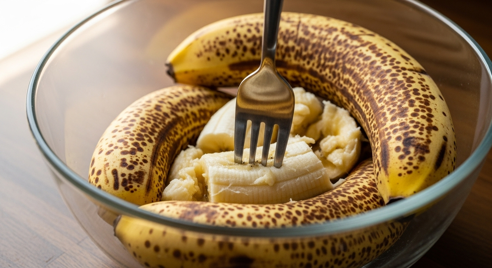

## Description

There are few things as comforting as the aroma of a freshly baked loaf of banana bread wafting through the kitchen. It's a timeless classic for a reason: it's simple, delicious, and the perfect way to use up those bananas you forgot on the counter. But not all banana breads are created equal. This recipe is your new go-to for a loaf that is incredibly **moist, tender, and bursting with rich banana flavor**. The secret lies in using very ripe, almost-black bananas and a few simple techniques that guarantee a perfect result every time. Whether you enjoy a slice for breakfast, as a snack, or for dessert, this is the only banana bread recipe you'll ever need.

## Ingredients

### Dry Ingredients
*   **2 cups all-purpose flour**
*   **1 tsp baking soda**
*   **1/4 tsp salt**
*   **1/2 tsp ground cinnamon** (optional, but recommended)

### Wet Ingredients
*   **1/2 cup unsalted butter**, softened to room temperature
*   **3/4 cup packed light brown sugar**
*   **2 large eggs**, at room temperature
*   **1 tsp pure vanilla extract**
*   **4 very ripe medium bananas**, mashed (about 1 ½ cups)

## Instructions

1.  **Preheat Oven & Prep Pan:** Preheat your oven to 350°F (175°C). Grease and flour a 9x5 inch loaf pan. Alternatively, line the pan with parchment paper, leaving an overhang on the two long sides to easily lift the bread out later.
2.  **Combine Dry Ingredients:** In a medium bowl, whisk together the all-purpose flour, baking soda, salt, and ground cinnamon. Set aside.
3.  **Mash the Bananas:** In a separate small bowl, mash the ripe bananas with a fork until they reach your desired consistency. Some small lumps are perfectly fine and add great texture.

    

4.  **Cream Butter & Sugar:** In a large bowl, using a stand mixer or a hand mixer, cream the softened butter and brown sugar together on medium speed until the mixture is light and fluffy, about 2-3 minutes.
5.  **Add Eggs & Vanilla:** Beat in the eggs one at a time, mixing well after each addition. Scrape down the sides of the bowl as needed. Stir in the vanilla extract.
6.  **Combine Wet Ingredients:** Add the mashed bananas to the butter and sugar mixture and stir until just combined.
7.  **Mix the Batter:** Gradually add the dry ingredient mixture to the wet ingredients, mixing on low speed until just combined. **Do not overmix!** Mix only until you no longer see streaks of flour. Overmixing can lead to a tough, dense loaf.

    

8.  **Pour & Level:** Pour the batter into your prepared loaf pan and use a spatula to spread it into an even layer.

    

9.  **Bake to Perfection:** Bake for 55-65 minutes. To check for doneness, insert a wooden toothpick or a long skewer into the center of the loaf. It's ready when the toothpick comes out clean or with a few moist crumbs attached. If the top is browning too quickly, you can loosely tent it with aluminum foil for the last 15-20 minutes of baking.
10. **Cool Completely:** Let the banana bread cool in the pan on a wire rack for 10-15 minutes. Then, use the parchment paper overhangs (or carefully invert the pan) to remove the loaf and place it directly on the wire rack to cool completely before slicing. This step is crucial for the bread to set properly.

    

## Recommended Tools

*   **9x5 Inch Loaf Pan:** The standard size for this recipe, ensuring even baking.
*   **Mixing Bowls:** A set of nesting bowls is always useful for separating wet and dry ingredients.
*   **Wire Cooling Rack:** Absolutely essential for allowing air to circulate around the loaf, preventing a soggy bottom.

*(Note: The links in the frontmatter might be affiliate links. If you purchase through them, we may earn a small commission at no extra cost to you. Thanks for your support!)*

## Tips for the Best Banana Bread

### The Riper, The Better
This is the number one rule for amazing banana bread. Bananas with heavy brown or black spots on the peel are significantly sweeter and contain more moisture, which translates directly to a more flavorful and tender loaf.

### Measure Flour Correctly
Avoid scooping your measuring cup directly into the bag of flour. This compacts the flour, and you'll end up with too much, resulting in dry bread. Instead, use a spoon to fluff up the flour, then spoon it into your measuring cup and level it off with the back of a knife.

### Don't Overmix the Batter
When you combine the wet and dry ingredients, you're developing gluten. A little gluten provides structure, but too much will make your banana bread tough and dense. Mix only until the flour is just incorporated. A few lumps are okay!

### Room Temperature Ingredients
Using room temperature butter and eggs is key. Softened butter creams more easily with sugar, creating air pockets that help the bread rise. Room temperature eggs mix more evenly into the batter, creating a smoother, more uniform texture.

## Variations and Add-ins

This classic recipe is a fantastic base for customization. Here are a few ideas:

*   **Nutty Crunch:** Fold in 3/4 cup of chopped walnuts or pecans into the batter before pouring it into the pan.
*   **Chocolate Lover's Dream:** Add 1 cup of semi-sweet, milk, or dark chocolate chips for a decadent twist.
*   **Extra Spice:** Along with cinnamon, add 1/4 teaspoon of nutmeg and a pinch of allspice for a warmer flavor profile.
*   **Sweet Topping:** Sprinkle the top of the batter with turbinado sugar before baking for a crunchy, sweet crust. Or, create a simple streusel topping with flour, brown sugar, cinnamon, and cold butter.

## Watch The Recipe Video

<iframe
  src="https://www.youtube.com/embed/Z8t3hR0jJ0A"
  title="YouTube video player"
  frameborder="0"
  allow="accelerometer; autoplay; clipboard-write; encrypted-media; gyroscope; picture-in-picture"
  allowfullscreen>
</iframe>

## Frequently Asked Questions (FAQ)

### Why did my banana bread sink in the middle?
This is a common issue that usually points to one of two things: it was underbaked, or the batter was overmixed. Ensure a toothpick inserted into the very center comes out clean. Too much leavening (baking soda) can also cause it to rise too fast and then collapse.

### Can I use frozen bananas?
Yes! Frozen bananas are excellent for banana bread. Just let them thaw completely at room temperature. They will release a lot of liquid; be sure to include that liquid along with the mashed banana in your batter for extra moisture.

### How do I store banana bread to keep it moist?
Store it in an airtight container or wrap it tightly in plastic wrap. It will stay fresh at room temperature for up to 3 days. For longer storage, you can keep it in the refrigerator for up to a week.

### Can I make this recipe into muffins?
Absolutely. Pour the batter into a lined muffin tin, filling each cup about 3/4 full. Bake at 350°F (175°C) for 20-25 minutes, or until a toothpick comes out clean. This recipe will yield about 12 standard-sized muffins.

### Can I reduce the sugar?
You can reduce the sugar to 1/2 cup if you prefer a less sweet bread, but it may affect the overall moisture and texture slightly. The ripe bananas provide a lot of natural sweetness.