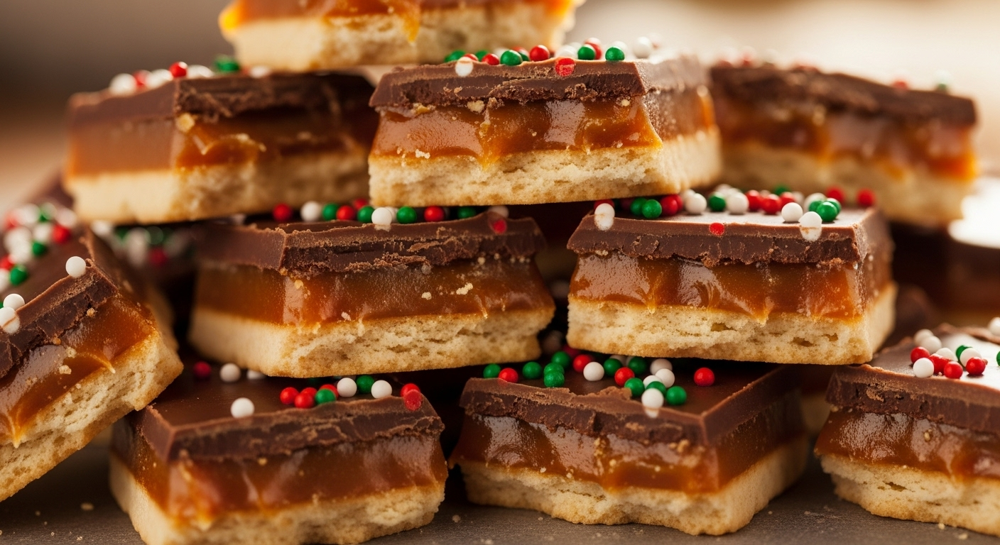

If there's one holiday treat that's famously addictive and disappears from the dessert table in minutes, it's this **Christmas Cracker Candy**. Also known as "Christmas Crack," this ridiculously easy recipe creates the most incredible sweet and salty confection with just a handful of simple ingredients.

This treat features a layer of salty crackers, a rich and buttery toffee, and a smooth layer of melted chocolate. It's crunchy, chewy, sweet, salty, and absolutely irresistible. Whether you're a seasoned baker or a complete novice, you can master this recipe and create a holiday favorite that everyone will be begging you for.

## What is Christmas Cracker Candy?

At its core, Christmas Cracker Candy is a simple layered bar candy. The magic comes from the combination of textures and flavors:

*   **The Base:** A single layer of saltine crackers provides the salty, crispy foundation.
*   **The Toffee:** A simple mixture of butter and brown sugar is boiled and poured over the crackers, then baked to create a rich, crunchy toffee layer.
*   **The Topping:** Melted chocolate is spread over the warm toffee and can be decorated with various toppings before it sets.

The result is a sheet of candy that you break into beautifully imperfect, rustic pieces.

## Ingredients

You only need a few pantry staples to make this amazing holiday candy.

*   **~40 Saltine Crackers:** Enough to line your baking sheet in a single layer.
*   **1 cup Unsalted Butter:** Cut into pieces.
*   **1 cup Packed Light Brown Sugar:** This creates the caramel-like toffee.
*   **1 tsp Vanilla Extract:** Adds depth of flavor to the toffee.
*   **2 cups (12 oz) Semi-Sweet Chocolate Chips:** Or your favorite type of chocolate.
*   **Optional Toppings:** Sea salt, festive sprinkles, chopped pecans or walnuts, crushed peppermint candies.

## Instructions

1.  **Prep Your Pan:** Preheat your oven to 350°F (175°C). Line a rimmed baking sheet (approx. 10x15 inches) with parchment paper or heavy-duty aluminum foil, making sure to leave some overhang to easily lift the candy out later. Grease the foil or parchment lightly.
2.  **Arrange the Crackers:** Lay the saltine crackers in a single, even layer on the prepared baking sheet, covering the entire surface. They should be side-by-side, touching.

    

3.  **Make the Toffee:** In a medium saucepan over medium heat, melt the butter and brown sugar together. Bring the mixture to a boil, stirring constantly. Once it's boiling, continue to let it boil for 3 minutes without stirring.
4.  **Pour and Bake:** After 3 minutes, remove the saucepan from the heat and stir in the vanilla extract. Be careful, as it may bubble up. Immediately and carefully pour the hot toffee mixture evenly over the saltine crackers. Use a spatula to spread it out if needed.
5.  **First Bake:** Place the baking sheet in the preheated oven and bake for 5-6 minutes. The toffee will be bubbly and spread out.
6.  **Add the Chocolate:** Remove the pan from the oven. Sprinkle the chocolate chips evenly over the hot toffee. Let the pan sit for 5 minutes. The residual heat will melt the chocolate chips.

    

7.  **Spread and Decorate:** Use an offset spatula or the back of a spoon to spread the melted chocolate into a smooth, even layer. If you're using toppings like sprinkles, nuts, or sea salt, sprinkle them on now while the chocolate is still wet.
8.  **Cool and Harden:** Let the candy cool completely. You can leave it at room temperature for a few hours or, for a faster set, place it in the refrigerator for about 30-60 minutes until the chocolate is firm.
9.  **Break and Serve:** Once the candy is completely set, lift it out of the pan using the parchment or foil overhang. Break it into pieces with your hands or use a knife to cut it. Store in an airtight container.

    

## Tips for the Best Cracker Candy

*   **Line Your Pan:** Do not skip this step! Lining the pan with foil or parchment paper is crucial for easy removal and cleanup.
*   **Watch the Toffee:** Three minutes of boiling is usually the sweet spot. Boiling it too long can cause it to separate or become too hard, while not boiling it long enough may result in a toffee that doesn't set properly.
*   **Work Quickly:** Once the toffee is ready, pour and spread it immediately over the crackers before it starts to cool and thicken.

## Variations and Topping Ideas

This recipe is incredibly versatile! Feel free to customize it.

*   **Different Crackers:** While saltines are classic, you can try this with Ritz crackers, Club crackers, or even pretzels for a different flavor and texture.
*   **Chocolate Choices:** Use milk chocolate, dark chocolate, white chocolate, or even a mix. Butterscotch chips or peanut butter chips are also delicious additions.
*   **Topping Frenzy:** Get creative with your toppings!
    *   Flaky sea salt for a perfect sweet and salty finish.
    *   Chopped nuts like pecans, walnuts, almonds, or pistachios.
    *   Festive red and green sprinkles.
    *   Crushed peppermint candies or candy canes.
    *   A drizzle of melted white chocolate over the dark chocolate layer.

## Frequently Asked Questions (FAQ)

### Can I make this ahead of time?
Absolutely! This is a great make-ahead treat. It can be stored in an airtight container at room temperature for up to a week, or in the refrigerator for up to two weeks. The crackers may soften slightly over time.

### Can I use salted butter instead of unsalted?
Yes, you can. If you use salted butter, you may want to skip adding any extra sea salt on top, but the result will still be delicious.

### My toffee separated or looks greasy. What went wrong?
This can happen if the toffee is cooked too high or for too long, causing the butter to separate. Keep the heat on medium and stick to the 3-minute boil time. If it does separate, you can sometimes save it by whisking vigorously off the heat, but it's best to prevent it from happening.

### How do I store Christmas Cracker Candy?
Store it in an airtight container, separating layers with parchment paper to prevent them from sticking together. It keeps well at room temperature for about a week, but if your house is warm or you prefer it very firm, store it in the refrigerator.