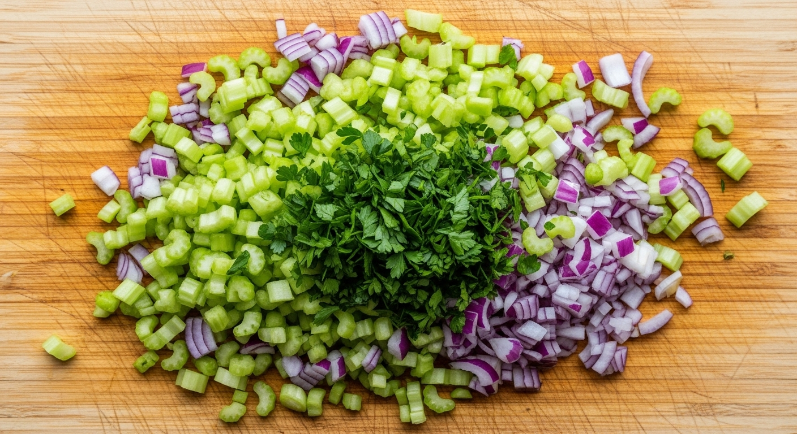
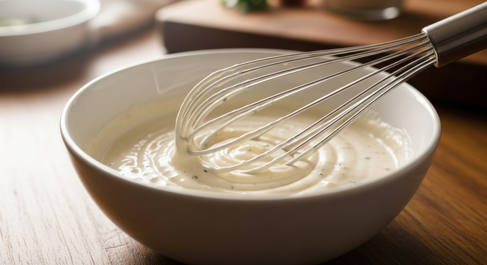

## Description

This is it: the **best classic chicken salad recipe** you'll ever need. It's the perfect balance of creamy, crunchy, savory, and fresh. Made with tender shredded chicken, crisp celery, a hint of red onion, and a simple yet flavorful dressing, this recipe is a timeless favorite for a reason. It's incredibly **versatile and easy to make**, making it the ultimate solution for quick lunches, light dinners, potlucks, and picnics. Serve it on croissants, in a lettuce wrap, or simply with a side of crackers. Once you try this simple, delicious recipe, it will become a staple in your meal rotation.

## Ingredients

### For the Chicken Salad
*   **3 cups cooked, shredded chicken** (from about 1.5 lbs of boneless, skinless chicken breasts or a rotisserie chicken)
*   **1 cup celery**, finely chopped
*   **1/4 cup red onion**, finely chopped
*   **2 tablespoons fresh parsley**, chopped
*   **1 tablespoon fresh dill**, chopped (optional, but recommended)

### For the Creamy Dressing
*   **3/4 cup good-quality mayonnaise**
*   **1 tablespoon lemon juice**, fresh
*   **1 tablespoon Dijon mustard**
*   **1/2 teaspoon salt** (or to taste)
*   **1/4 teaspoon black pepper** (or to taste)

## Instructions

1.  **Prepare the Chicken:** If you're not using a pre-cooked rotisserie chicken, cook your chicken breasts. You can poach, bake, or grill them until cooked through (165°F or 74°C). Let the chicken cool down completely. Once cooled, shred it using two forks or, for a quick trick, use a stand mixer with the paddle attachment for perfectly shredded chicken in seconds.

    

2.  **Chop the Vegetables:** While the chicken is cooling, finely chop your celery, red onion, parsley, and dill. A fine chop ensures you get a little bit of every flavor and texture in each bite without any single ingredient being overpowering.

    

3.  **Mix the Dressing:** In a small bowl, whisk together the mayonnaise, fresh lemon juice, Dijon mustard, salt, and black pepper until smooth and creamy. Taste the dressing and adjust the seasoning if necessary.

    

4.  **Combine Everything:** In a large mixing bowl, combine the shredded chicken, chopped celery, red onion, parsley, and dill. Pour the prepared dressing over the chicken mixture.
5.  **Gently Mix:** Use a spatula or large spoon to gently fold all the ingredients together until the chicken and vegetables are evenly coated in the dressing. Be careful not to overmix, as this can make the salad mushy.

    

6.  **Chill and Serve:** For the best flavor, cover the bowl and refrigerate the chicken salad for at least 30 minutes. This allows the flavors to meld together beautifully. Serve chilled on your favorite bread, in a wrap, or on a bed of lettuce.

## Recommended Tools

*   **Large Mixing Bowl:** You'll need a good-sized bowl to combine all the ingredients without making a mess.
*   **Stand Mixer:** While not essential, using a stand mixer with the paddle attachment is the fastest, easiest way to shred chicken.
*   **Sharp Chef's Knife:** A sharp knife makes chopping the celery, onion, and herbs a quick and easy task.

*(Note: The links in the frontmatter might be affiliate links. If you purchase through them, we may earn a small commission at no extra cost to you. Thanks for your support!)*

## Tips for the Best Chicken Salad

### Use Quality Ingredients
The simplicity of this recipe means the quality of each ingredient shines through. Use a good, creamy mayonnaise and fresh herbs for the best possible flavor.

### Don't Skimp on the Celery
The celery provides an essential crunchy texture that contrasts beautifully with the creamy dressing and tender chicken. Make sure it's chopped finely for the best result.

### Let it Chill
Chilling the chicken salad for at least 30 minutes before serving is a crucial step. It gives the flavors time to mingle and deepen, resulting in a much more delicious final product.

## Variations and Add-Ins

This classic recipe is a fantastic base for customization!

*   **Sweet & Nutty:** Add 1/2 cup of halved red grapes and 1/3 cup of toasted, chopped pecans or walnuts.
*   **Fruity Twist:** For a touch of sweetness, add 1/2 cup of chopped apples (like Honeycrisp) or dried cranberries.
*   **Herby Delight:** Swap the parsley and dill for fresh tarragon for a sophisticated, slightly anise-like flavor.
*   **Lighter Version:** Substitute half of the mayonnaise with plain Greek yogurt for a lighter, tangier dressing.
*   **Add Some Spice:** Mix in a pinch of curry powder or a dash of hot sauce for a little kick.

## Watch How to Make It

<iframe
  src="https://www.youtube.com/embed/V-tjLpMeYMA"
  title="YouTube video player"
  frameborder="0"
  allow="accelerometer; autoplay; clipboard-write; encrypted-media; gyroscope; picture-in-picture"
  allowfullscreen>
</iframe>

## Frequently Asked Questions (FAQ)

### How long does homemade chicken salad last?
Stored in an airtight container in the refrigerator, chicken salad will stay fresh for 3 to 5 days.

### Can I use canned chicken?
Yes, you can use canned chicken in a pinch. Be sure to drain it very well to avoid a watery salad. However, for the best texture and flavor, freshly cooked or rotisserie chicken is highly recommended.

### Can I freeze chicken salad?
It's generally not recommended to freeze chicken salad. Mayonnaise tends to separate when it thaws, which can result in a greasy, unappealing texture.

### What's the best chicken to use for chicken salad?
Rotisserie chicken is a fantastic time-saver and is very flavorful. Alternatively, poaching boneless, skinless chicken breasts in seasoned water is a great way to ensure the chicken is moist and tender.

### My chicken salad is a bit dry. How can I fix it?
Simply mix in another tablespoon or two of mayonnaise until it reaches your desired creaminess. You can also add a small splash of lemon juice or even pickle juice to add moisture and flavor.